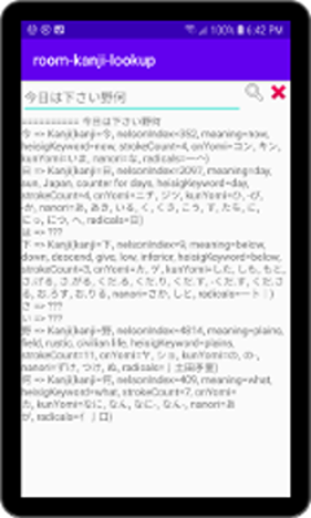

# android-room-kanji-lookup
simple android kotlin app using room with pre-built kanjidic sql database for kanji lookup

Sun Jul 12 2020
I recently wrote a simple Kanji Dictionary called AnimatedKanjiViewer.  It is the first app I've written using Android's Room SQL interface.  I wanted to use Room with an existing SQL database as the means to look up the Kanji but I had a hard time finding examples that used existing databases: all seemed to create the database in the app.  I ended up writing a test-bed so as to have a simple app to learn on.  This app is the result.

As Android apps go, this is almost a trivial app.  The user interface is a search window and a text view and all of the Room code is in a single file: KanjiDbSearch.kt.  I used a [SearchWindow](https://github.com/bebop-001/SearchWindow) custom view which simplified the callback and search operations.  KanjiDbSearch.kt implements a simple singleton and this is started as a background task in the MainActivity.kt file.  The searchOnClick gets called when the user selects search and this does our SQL query.  Kanji and non-kanji are separated in the query code.  It turned out to be a really clean, simple piece of code (IMHO).

I used the KanjiDic files from Electronic Dictionary Research and Development Group for information on almost 14,000 Kanji as well as the Heisig keywords and multi-radical Kanji information.  The kanji sql database is loaded from the assets/db directory.

This is the same code I used in the search part of AnimatedKanjiViewer but the viewer app uses animated gif files that I don't have distribution rights to so I can't open-source it.  However is is free.  I included links to it below. 

[]

      
 

